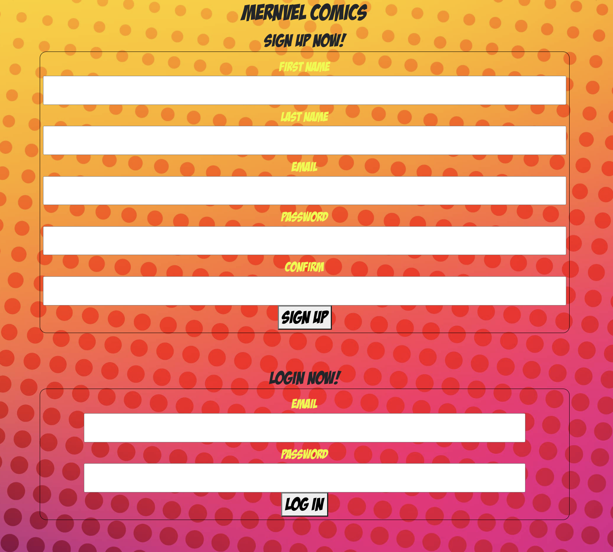

# MERNvel Comics #

Create an account and sign in to view the entire library of Marvel Comics, over 50,000!

------
## Visit MERNvel Comics ##

Click the link below to visit the app!

<!-- link to deployed site -->
------
## Screenshots ##

------
## Technologies Used ##

MERNvel Comics is a MERNstack app with the following technologies:

1. MongoDB
2. Express
3. React
4. Node
5. Bootstrap

Trello.com was used as a whiteboard for our developers to design and layout the app's construction.

------

## Future Enhancements ##

Our goals and features we would love to include in future updates include:

1. A revolving display in the library containing featured comics that are currently popular

2. Being able to read the full comic on its own page.

------

## About The Dev Team ##

This app was created as a group project in the General Assembly Software Engineering bootcamp. The creation of MERNvel Comics was brought to you by Alex Min Soo Kang, Gissell Valdez, and Nathan Taft.

